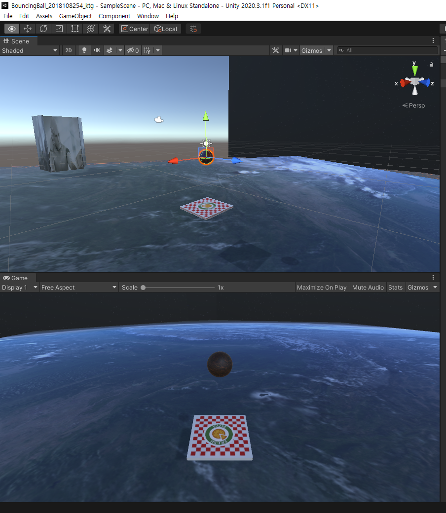

# BouncingBall_Homework

- 제출 날짜: 2022.09.30. (5주차 과제)

Unity Homework use Unity 2020.3.1f1

Bouncing Ball game / backup




|use asset|
|:---:|
| [지구](https://assetstore.unity.com/packages/p/earth-planets-skyboxes-53752) |
| [피자](https://assetstore.unity.com/packages/3d/props/interior/party-pack-196474) |
| [용암](https://assetstore.unity.com/packages/2d/textures-materials/stone/stylized-lava-pbr-texture-200039) |
|[image](https://lostark.game.onstove.com/Artwork) |
|Blutgruppe/Corbis|

## error log

during subtree add time 

```
Unlink of file 'BouncingBall_Homework/Library/PackageCache/com.unity.collab-proxy@1.3.9/Documentation~' failed. Should I try again? (y/n) n

warning: unable to unlink 'BouncingBall_Homework/Library/PackageCache/com.unity.collab-proxy@1.3.9/Documentation~': Directory not empty

fatal: cannot create directory at 'BouncingBall_Homework/Library/PackageCache/com.unity.collab-proxy@1.3.9/Documentation~': Directory not empty
```